# 第二章 系统设计与实现

说明：当前工作区已包含系统方案文档、核心源码、页面截图、仿真样例和算法报告，但未包含正式的 CAD、SCH、PCB 原始工程文件。因此本章在机械设计与电路设计部分采用“样机结构图 + 接口级原理框图”的写法，适合课程设计、项目答辩和技术汇报；若后续补充 KiCad/Altium 文件，可直接替换对应插图。

## 2.1 整体介绍

本系统面向城市低空无人机任务场景，目标不是实现底层飞控，而是构建一套基于 SC171 的“无人机里程规划、天气驱动能耗预测、候选路径规划、风险评估与虚拟验证”一体化系统。系统从气象数据、城市建筑、任务参数和飞行器参数出发，在任务起飞前给出能耗预测结果、可达性判断和推荐航线，并通过三维虚拟验证环境对结果进行可视化复核。

从工程角色上看，系统采用“边缘端开发板 + PC/云端算法与仿真资源”的分层架构。SC171 开发板承担任务配置、结果展示、边缘决策、传感器采集和蜂鸣器告警职责，并通过显示屏展示前端页面；PC/云端承担天气数据获取、垂直气象重建、候选航线规划、虚拟仿真和模型训练职责；二者通过 HTTP 或串口协议交换任务参数、天气剖面、预测曲线和风险结论。需要说明的是，当前前端页面使用的气象数据仍为历史气象样本或离线接口产物，板端温湿度气压一体传感器、电压传感器、风速风向传感器用于现场实时测量和告警，不等同于前端气象数据的实时接入。

### 图 2-1 系统整体框图

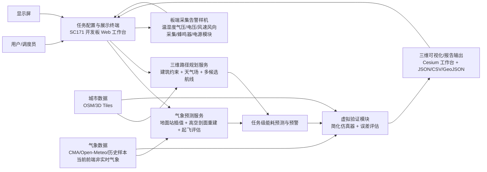

### 表 2-1 系统各模块关系说明

| 模块 | 主要功能 | 关键输入 | 关键输出 | 与其他模块关系 |
| --- | --- | --- | --- | --- |
| 任务配置与展示终端 | 录入起终点、时间、载荷、高度、策略；展示三维城市、天气采样点和候选航线 | 用户指令、城市数据、天气结果 | 任务对象、界面可视化、报警状态 | 是系统的人机交互入口，向气象模块和路径规划模块发起请求 |
| 气象预测服务 | 生成目标点多高度天气剖面，评估起飞安全边界 | 地面站数据、高空探空数据、目标经纬度、目标高度 | `weather_profile`、风险摘要、最大安全高度 | 为能耗预测、路径规划和风险评估提供环境先验 |
| 三维路径规划服务 | 在建筑约束和天气约束下生成多条候选航线并排序 | 起终点、建筑 GeoJSON、天气场、规划模式 | `route_candidates.json`、GeoJSON 航线 | 直接为任务决策提供路线备选，并向虚拟验证提供输入 |
| 能耗预测与预警 | 根据天气、路径、载荷和电池参数推算任务能耗与续航边界 | 天气剖面、候选路径、电池参数、飞行器参数 | 预计总能耗、剩余电量、预警结论 | 位于系统决策核心层，上接天气/路径，下接验证与展示 |
| 虚拟验证模块 | 生成虚拟飞行时序，比较预测与仿真偏差 | 场景配置、路径、天气、车辆参数 | 能耗时序、误差指标、回放产物 | 用于闭环验证预测与规划结果是否合理 |
| 板端采集告警样机 | 执行传感器实时采集、本地阈值判断和蜂鸣器告警 | 环境物理量、电压状态、阈值策略、电源输入 | 风速/风向/温度/湿度/气压/电压实时值、蜂鸣器告警状态 | 是“算法落到硬件”的证明链路；其中温度、湿度和气压由同一个温湿度气压一体传感器测量，前端天气底图当前仍来自历史气象数据 |
| 显示屏展示端 | 显示 SC171 前端页面、候选航线、风险结论和传感器状态 | Web 页面、规划结果、告警状态 | 可视化页面和现场演示界面 | 是用户查看系统结果的现场显示载体 |

整体信息流可概括为：先由任务配置端生成任务对象，再由气象服务给出多高度环境剖面；路径规划模块结合建筑和天气生成候选航线；能耗预测模块给出每条航线的能耗、剩余电量和风险等级；最后虚拟验证模块对代表性方案进行时序复核，并把结果回显到三维工作台与板端终端。

## 2.2 硬件系统介绍

本项目的硬件系统采用“传感器实时采集 + 蜂鸣器告警 + 电源模块 + 显示屏展示”思路，以 SC171 为主控，把温湿度气压一体传感器、电压传感器、风速风向传感器接入板端，并由蜂鸣器执行超阈值告警。整套样机强调采集、判断、显示和告警链路的完整性，适合课程展示、现场演示和离线验证。系统硬件边界限定在传感采集、板端处理、声音告警、供电和页面显示范围内，环境数据注入和状态判断主要依赖传感器实时测量。

### 2.2.1 硬件整体介绍

结合当前实物图，硬件总体可概括为五部分：主控板、传感采集端、蜂鸣器告警端、供电端和显示端。主控板选用 SC171 开发套件，负责协议解析、数据采集、本地判断、页面承载和告警控制；传感采集端接入温湿度气压一体传感器、电压传感器以及风速风向传感器，用于实时获取现场环境和供电状态；蜂鸣器告警端在超阈值或异常状态下给出声音告警；供电端使用必要电源模块为主控和各类传感器提供稳定电能；显示端用于展示前端页面、航线规划结果、能耗预测结论和告警状态。

### 图 2-2 硬件总体组成框图

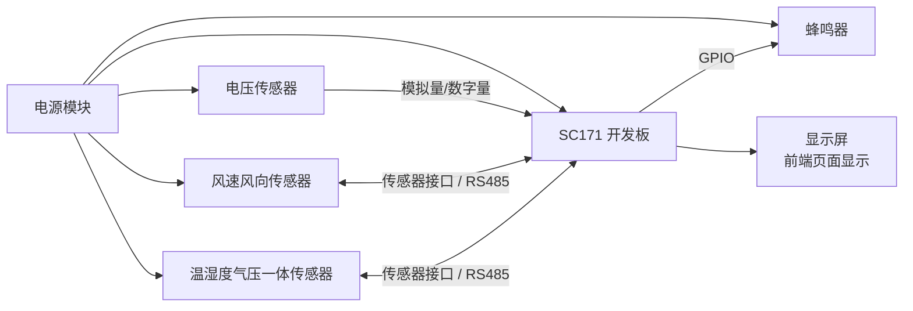

### 表 2-2 硬件模块与接口分工

| 硬件模块 | 推荐器件/形态 | 主要作用 | 典型接口 |
| --- | --- | --- | --- |
| 主控核心 | SC171 开发板 | 协议解析、数据采集、本地判断、页面承载、告警控制 | RS485、UART、GPIO、显示接口 |
| 温湿度气压采集 | 温湿度气压一体传感器 | 实时采集温度、湿度、气压 | 传感器接口 / RS485 |
| 风场采集 | 风速传感器、风向传感器 | 实时采集风速和风向 | 传感器接口 / RS485 |
| 电压采集 | 电压传感器 | 实时采集供电或电池电压，用于续航和异常判断 | 模拟量 / 数字量 |
| 告警模块 | 有源蜂鸣器 | 在超阈值时输出声音告警 | GPIO |
| 供电模块 | 稳压电源、电池模块或适配电源 | 为主控和传感器提供稳定能源 | VBAT、5V/3.3V |
| 显示模块 | 显示屏 | 显示前端页面、航线规划和预警结果 | HDMI/MIPI/USB/网络页面 |

### 2.2.2 机械设计介绍

当前样机采用“固定式采集、显示与告警验证结构”。结合当前实物图，样机上重点可见温湿度气压一体传感器、电压传感器、风速风向传感器、蜂鸣器、电源模块以及显示屏。这样设计有三个优点：第一，可在室内安全演示传感器采集、页面显示与超阈值告警逻辑；第二，传感器布置清晰，便于展示 SC171 与外设之间的接线关系；第三，结构简单、布线直观，适合课程展示与现场讲解。

从总体到局部，机械结构分为底座、传感安装区、控制告警区、供电区和显示区。底座负责承载和减振；传感安装区固定温湿度气压一体传感器、电压传感器以及风速风向传感器，保证采样稳定并便于走线；控制告警区固定 SC171 开发板和蜂鸣器；供电区布置电池模块、稳压模块或适配电源；显示区布置显示屏，用于展示前端页面和规划结果。该结构强调“传感器实时采集链路清晰”“显示屏可视化直观”和“蜂鸣器告警可演示”。

### 图 2-3 机械总体结构图

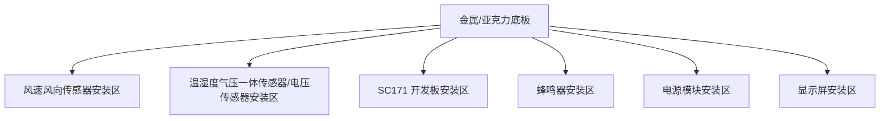

### 表 2-3 机械分层设计说明

| 层级 | 组成 | 设计要点 | 作用 |
| --- | --- | --- | --- |
| 总体层 | 台架底板、立柱、外罩 | 保证稳定性、安全性和布线空间 | 承载全部模块 |
| 传感层 | 温湿度气压一体传感器、电压传感器、风速传感器、风向传感器 | 采样位置合理、线缆清晰、便于维护 | 提供实时环境与供电状态数据 |
| 控制层 | SC171 主控板 | 接口集中、调试方便、固定可靠 | 完成采集、判断、页面承载与告警控制 |
| 告警层 | 蜂鸣器 | 声音清晰、触发直观 | 展示超阈值告警结果 |
| 供电层 | 电源模块、稳压单元 | 强弱电分区、供电稳定 | 为整套系统提供稳定电能 |
| 显示层 | 显示屏 | 页面清晰、亮度适合演示、固定可靠 | 展示前端页面、航线和风险结论 |

### 2.2.3 电路各模块介绍

由于当前工作区未包含正式 SCH/PCB 文件，本节按当前实物样机的真实接口关系给出电路模块划分和关键信号说明。整体电路遵循“传感采集回路”“蜂鸣器告警回路”“显示回路”和“供电回路”相对分离原则：电源模块经稳压后为 SC171 与各类传感器供电；温度、湿度、气压、风速、风向和电压数据送入主控完成实时测量，其中温度、湿度和气压由同一个温湿度气压一体传感器采集；主控通过 GPIO 驱动蜂鸣器，实现阈值告警和状态提示；前端页面则通过显示屏完成现场展示。电路设计重点是传感采集、供电稳定、告警触发和页面显示，不涉及飞行驱动、负载模拟或灯光指示电路。

### 图 2-4 电路总体连接框图

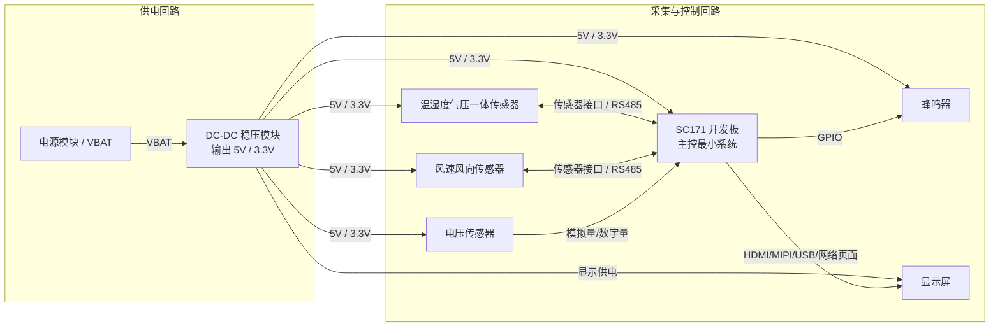

### 表 2-4 关键输入输出信号线说明

| 信号线 | 方向 | 所属模块 | 含义 |
| --- | --- | --- | --- |
| `VBAT` | 输入 | 电源模块 -> DC-DC | 系统供电输入 |
| `5V` / `3.3V` | 输出 | DC-DC -> 开发板/传感器/蜂鸣器/显示端 | 主控与外设工作电源 |
| `RS485_A/B` | 双向 | 传感器 <-> SC171 | 温度、湿度、气压、风速、风向等数据采集总线 |
| `VOLTAGE_SENSE` | 输入 | 电压传感器 -> SC171 | 供电或电池电压采样信号 |
| `GPIO_BUZZER` | 输出 | SC171 -> 蜂鸣器 | 超阈值声音告警触发 |
| `DISPLAY_OUT` | 输出 | SC171 -> 显示屏 | 前端页面和规划结果显示信号 |

### 图 2-5 板端电路模块层级图

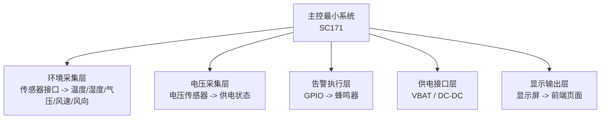

从功能闭环角度看，电路链路可分为四条主路径。第一条是“传感器实时采集路径”：温湿度气压一体传感器、风速风向传感器和电压传感器把现场环境与供电状态送入 SC171；第二条是“告警路径”：主控根据阈值判断结果触发蜂鸣器，向现场人员给出异常提醒；第三条是“供电路径”：电源模块为主控、传感器、显示屏和蜂鸣器提供稳定电能；第四条是“显示路径”：SC171 承载的前端页面通过显示屏展示里程规划、候选航线、能耗预测和告警状态。

## 2.3 软件系统介绍

软件系统采用“数据层 - 算法层 - 服务层 - 展示层”分层设计。数据层负责城市建筑、天气样本、仿真配置、传感器实时测量值和历史产物管理；算法层负责垂直气象剖面重建、起飞安全评估、候选航线规划、虚拟能耗仿真和误差对比；服务层负责对外提供 HTTP API 和页面服务；展示层负责三维城市工作台、航线交互、结果回放和显示屏页面展示。当前前端天气图层使用历史气象数据，并非由板端传感器实时刷新；板端实时数据主要用于本地状态测量、阈值告警和现场展示。

### 2.3.1 软件整体介绍

从系统部署方式看，软件由三个可独立运行的子系统组成：

1. `tianqi` 子系统：负责地面站融合、高空气象剖面生成、目标点低空天气预测和起飞安全评估，并通过 FastAPI 提供 `weather/profile` 和 `assess-takeoff` 接口。
2. `route-selection-module` 子系统：负责装载真实城市建筑与天气场，在“仅天气、仅建筑、综合”三种模式下生成多条候选航线，并输出 JSON/GeoJSON 结果。
3. `modules/uav_virtual_validation` 子系统：负责真实城市资产获取、天气场扩展、简化仿真、误差评估以及 Cesium 三维工作台展示。

### 图 2-6 软件总体分层架构图

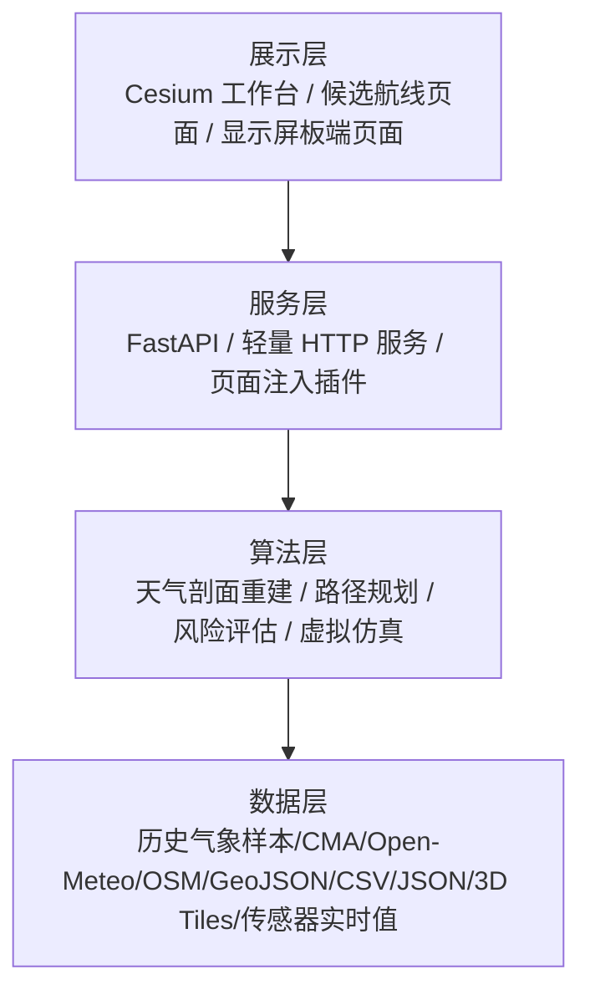

### 图 2-7 三维虚拟验证工作台界面


图 2-7 展示了城市三维建筑、天气采样点、任务航线、世界摘要和视角控制面板。该界面用于完成城市环境检查、航线观测和风险展示，是软件系统的主要可视化入口。

### 图 2-8 工作台总控与采样配置界面


图 2-8 展示了图层控制、建筑渲染方式、天气分辨率、采样高度层和世界摘要等功能，说明软件系统已经具备从数据加载到任务展示的闭环控制能力。

### 表 2-5 当前软件系统的实现依据

| 子系统 | 主要脚本/模块 | 当前能力 |
| --- | --- | --- |
| 气象预测 | `run_drone_weather_pipeline.py`、`api_server.py`、`show_qingyuan_height_weather.py` | 目标点天气剖面生成、起飞安全评估、API 输出 |
| 路径规划 | `serve_uav_workbench_route_selection.py`、`route_selection/planner.py` | 三模式候选航线规划、鲁棒性评估、排序输出 |
| 虚拟验证 | `weather/field.py`、`simulators/simple.py`、`validation/metrics.py` | 天气场扩展、任务仿真、预测对比和误差计算 |
| 三维展示 | `modules/uav_virtual_validation/web` | Cesium 城市加载、图层切换、路线与天气交互 |
| 板端展示与采集 | SC171 前端页面、传感器采集程序、蜂鸣器控制逻辑 | 显示屏页面展示、温度/湿度/气压/电压/风速/风向实时测量、本地阈值告警 |

为了说明算法层已经具备可量化能力，现有工作区中保留了真实训练报告。以武汉低空垂直气象模型为例，混合模型将温度 MAE 从 `2.631 °C` 降至 `2.046 °C`，气压 MAE 从 `3.236 hPa` 降至 `0.635 hPa`，风速 MAE 从 `4.002 m/s` 降至 `2.338 m/s`；这说明天气重建模块已具备支撑后续能耗预测与路径评估的工程基础。

### 关键指标可视化

为了更直观展示系统输出，本报告补充了预测误差、任务总能耗、剩余电量和规划耗时等关键指标图表。图表数据来自项目已有的能耗预测、真实飞行回放和特征方案对比输出文件，主要用于展示模型误差水平、任务电量约束和不同输入特征对预测性能的影响。

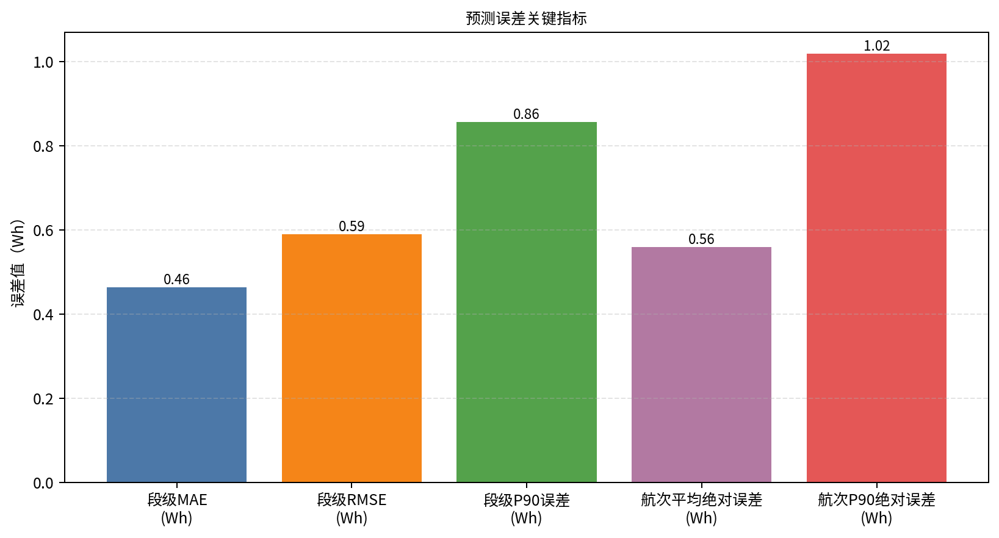

图 2-A 展示了段级 MAE、段级 RMSE、段级 P90 误差、航次平均绝对误差和航次 P90 绝对误差，可用于说明能耗预测模型在测试样本上的误差水平。

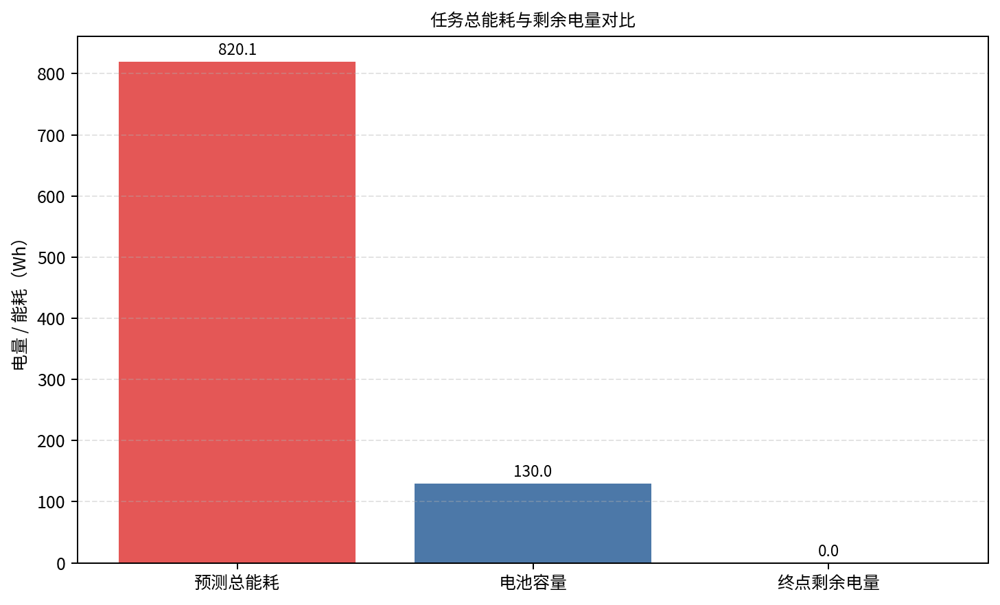

图 2-B 对比了预测总能耗、电池容量和终点剩余电量，用于判断当前任务是否存在电量不足风险。

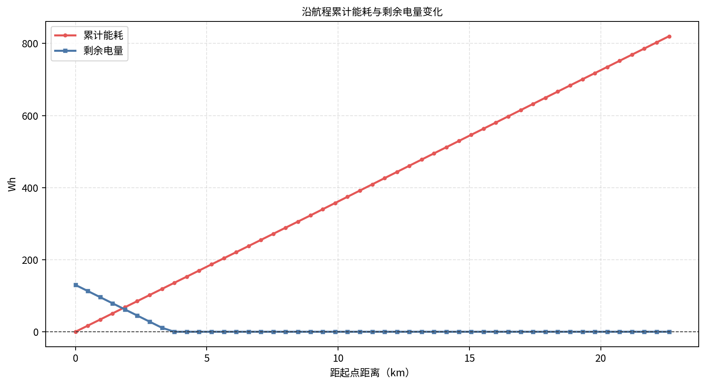

图 2-C 以航程距离为横轴展示累计能耗和剩余电量的变化过程，可用于观察电量随飞行过程的消耗趋势。

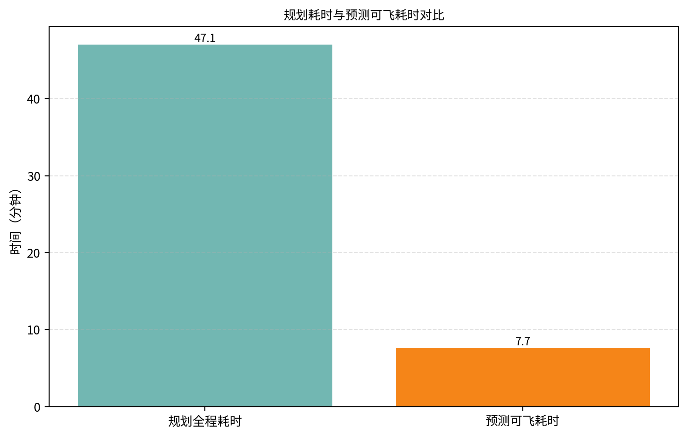

图 2-D 对比了规划全程耗时和模型预测可飞耗时，用于展示任务时间约束与电池续航能力之间的差距。

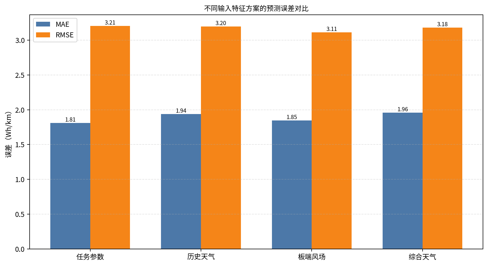

图 2-E 对比了任务参数、历史天气、板端风场和综合天气等不同输入特征方案下的 MAE 与 RMSE，可用于说明天气相关特征对能耗预测误差的影响。

### 2.3.2 软件各模块介绍

本节按“顶层入口 -> 核心函数链 -> 关键输入输出变量”的方式介绍软件模块。

#### 2.3.2.1 低空气象预测与起飞安全评估模块

该模块位于 `tianqi` 子系统中，顶层入口既可以是命令行脚本 `run_drone_weather_pipeline.py`，也可以是 API 接口 `POST /api/v1/weather/assess-takeoff`。其核心任务是把地面站观测、高空探空样本和局部模型融合为目标点多高度天气剖面，再据此判断起飞与巡航安全边界。

##### 图 2-9 气象预测模块流程图

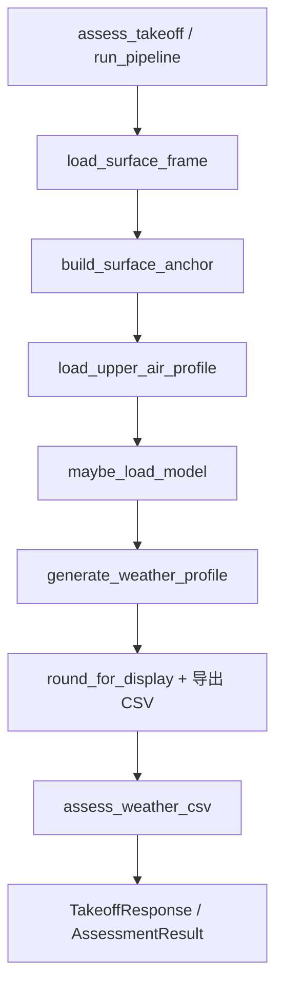

##### 表 2-6 气象预测模块关键函数与变量

| 层级 | 关键函数 | 关键输入变量 | 关键输出变量 |
| --- | --- | --- | --- |
| 顶层 | `run_pipeline(args)` | `target_lat`、`target_lon`、`target_ground_height_m`、`target_alt_m`、`target_heights_m` | `weather_csv`、`profile_frame`、`assessment` |
| 数据预处理层 | `build_surface_anchor(...)` | 地面站 CSV、邻站数量、IDW 幂次 | 目标点地面锚点 `anchor` |
| 高空数据层 | `load_upper_air_profile(sample_json)` | 探空 JSON | 标准化高空剖面 `api_profile` |
| 模型层 | `generate_weather_profile(...)` | `payload`、`api_profile`、`anchor`、`planned_heading_deg` | 多高度天气表 `profile_frame` |
| 评估层 | `assess_weather_csv(...)` | 风速阈值、侧风阈值、温度阈值、空气密度阈值 | `overall_status`、`max_safe_altitude_m`、`risk_summary` |

在变量定义上，`target_lat`、`target_lon` 和 `target_ground_height_m` 决定任务几何位置，`target_heights_m` 决定剖面采样层，`planned_heading_deg` 用于把风向分解为顺逆风和侧风分量，`max_wind_mps`、`max_crosswind_mps`、`min_temp_c`、`min_density` 用于构建安全边界。最终输出既包含结构化天气剖面，也包含适合板端直接消费的风险摘要。

#### 2.3.2.2 候选航线规划模块

该模块位于 `route-selection-module` 中，顶层服务入口为 `handle_route_selection_plan(request)`，核心算法由 `CityRoutePlanner.plan()` 完成。系统当前支持三种模式：`combined` 综合模式、`weather_only` 仅天气模式和 `building_only` 仅建筑模式。

##### 图 2-10 候选航线规划模块流程图

```mermaid
flowchart TD
    A[handle_route_selection_plan] --> B[load_city_assets_from_dataset]
    B --> C[CityRoutePlanner.from_payloads]
    C --> D[plan(PlannerRequest)]
    D --> E[_normalize_request / _validate_request]
    E --> F[_grid_axes / _altitude_layers]
    F --> G[_astar 多策略搜索]
    G --> H[_build_candidate / _segment_stats]
    H --> I[_evaluate_route_robustness]
    I --> J[_entropy_weight_topsis]
    J --> K[to_dict + write_plan_outputs]
```

##### 表 2-7 航线规划模块关键函数与变量

| 层级 | 关键函数 | 关键输入变量 | 关键输出变量 |
| --- | --- | --- | --- |
| 顶层 | `handle_route_selection_plan(request)` | `dataset_key`、`planning_mode`、起终点经纬度 | 规划结果 `payload` |
| 资源装载层 | `load_city_assets_from_dataset(dataset_key)` | 数据集键值 | `city_config`、`city_summary`、`weather`、`buildings`、`ground` |
| 参数层 | `PlannerRequest(...)` | `cell_m`、`safety_clearance_m`、`cruise_speed_mps`、`max_altitude_m` | 标准化规划请求对象 |
| 搜索层 | `_astar(...)` | 栅格节点、天气场、建筑索引、代价参数 | 原始三维路径 |
| 评估层 | `_build_candidate(...)`、`_segment_stats(...)` | 路径点列、天气状态、建筑暴露信息 | 候选航线指标 |
| 鲁棒性层 | `_evaluate_route_robustness(...)` | 路径、天气扰动、蒙特卡洛次数 | `robustness_score`、`reliability_ratio` |
| 排序层 | `_entropy_weight_topsis(...)` | 多航线指标矩阵 | `ranking_weights`、综合 `score` |

该模块的关键输入变量包括：`start_lat`、`start_lon`、`end_lat`、`end_lon` 用于定义任务边界；`planning_mode` 用于决定是否考虑天气或建筑；`cell_m` 决定离散栅格粒度；`safety_clearance_m` 决定楼顶净空；`cruise_speed_mps`、`climb_speed_mps` 和 `descend_speed_mps` 影响时间和代价计算；`max_altitude_m` 决定可用高度层。

输出变量集中在 `RouteCandidate` 结构中，主要包括：`score`、`topsis_score`、`robustness_score`、`reliability_ratio`、`distance_m`、`estimated_duration_s`、`max_headwind_mps`、`max_crosswind_mps`、`average_urban_density`、`average_reachability_index` 和 `waypoints`。这些变量既能用于技术评估，也能直接映射到前端页面和答辩图表。

#### 2.3.2.3 真实城市天气场扩展与虚拟仿真模块

该模块位于 `modules/uav_virtual_validation` 中，功能是把真实城市建筑、二维天气输入和任务路径扩展为可用于验证的三维天气采样场与虚拟飞行时序，并输出误差指标。

##### 图 2-11 虚拟验证模块流程图

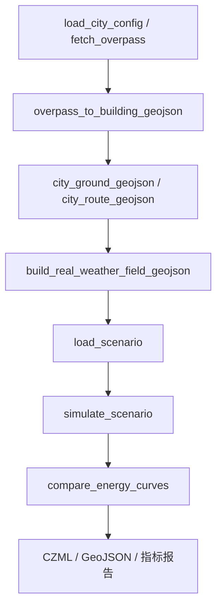

##### 表 2-8 虚拟验证模块关键函数与变量

| 层级 | 关键函数 | 关键输入变量 | 关键输出变量 |
| --- | --- | --- | --- |
| 城市资产层 | `build_overpass_query(city)`、`fetch_overpass(query)` | `bbox`、Overpass URL | OSM 原始要素 |
| 建筑建模层 | `overpass_to_building_geojson(city, payload)` | 建筑标签、层数、默认高度 | `real_buildings.geojson` |
| 天气场层 | `build_real_weather_field_geojson(...)` | `weather_payload`、航线、采样层、横向偏移 | `real_weather_field.geojson` |
| 仿真层 | `simulate_scenario(scenario)` | 起终点、天气、车辆参数、环境风险区 | `summary`、`timeseries` |
| 验证层 | `compare_energy_curves(pred_rows, sim_rows)` | 预测能耗序列、仿真能耗序列 | `energy_mae_wh`、`energy_mape_pct`、终值误差 |

`build_real_weather_field_geojson()` 的关键输入包括 `along_samples`、`lateral_offsets_m` 和 `altitude_layers_m`，它们决定天气采样场的空间分辨率；`simulate_scenario()` 的关键输入包括 `cruise_speed_mps`、`battery_wh`、`wind_speed_mps`、`wind_dir_deg`、`temperature_c` 和 `risk_zones`，其输出的 `cumulative_energy_wh`、`remaining_battery_wh` 和 `risk_score` 是后续比较的基础变量；`compare_energy_curves()` 则把预测值和仿真值统一到同一时间索引下，输出平均误差和终点误差。

#### 2.3.2.4 Web 服务与可视化交互模块

该模块承担所有人机交互职能，负责把算法层结果组织成可视化页面和接口响应。其顶层服务包括：`/api/v1/weather/profile`、`/api/v1/weather/assess-takeoff`、`/api/route-selection/plan`、`/api/route-selection/weather` 和虚拟验证工作台静态页面。

##### 图 2-12 Web 服务与页面交互流程图

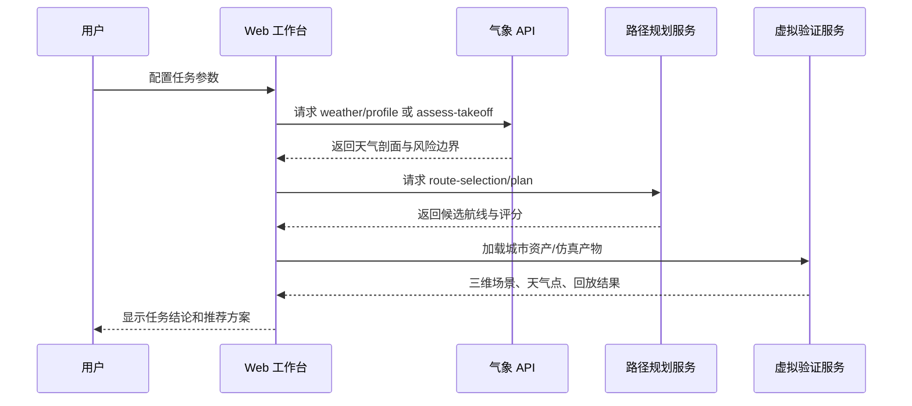

##### 表 2-9 Web 交互模块关键输入输出

| 服务入口 | 输入 | 输出 | 用途 |
| --- | --- | --- | --- |
| `/api/v1/weather/profile` | 起飞点、目标高度、航向 | 多高度天气剖面 | 提供环境先验 |
| `/api/v1/weather/assess-takeoff` | 起飞点、阈值参数 | 风险等级、最大安全高度、剖面 | 提供安全门控 |
| `/api/route-selection/plan` | 数据集、规划模式、起终点、速度/高度约束 | `route_candidates.json` | 生成多条候选航线 |
| 三维工作台页面 | 城市数据、天气场、纠错版本 | 场景显示与交互结果 | 展示建筑、天气、航线和风险 |

从软件总体结构看，本系统已经形成一条清晰的闭环：气象模块提供多高度环境先验，规划模块提供多候选路径，能耗/风险模块给出任务级结论，虚拟验证模块提供时序复核，最终由工作台和板端界面完成面向用户的交互展示。这一架构既满足嵌入式比赛对“硬件在环”和“边缘部署”的要求，也满足无人机任务研究对“预测、优化、验证、展示”一体化的工程要求。
